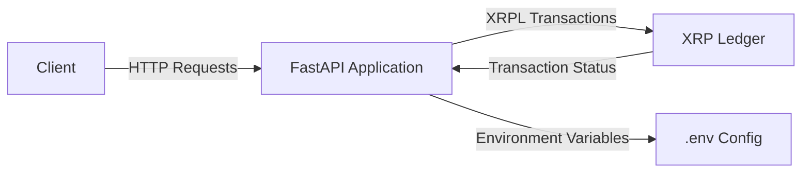
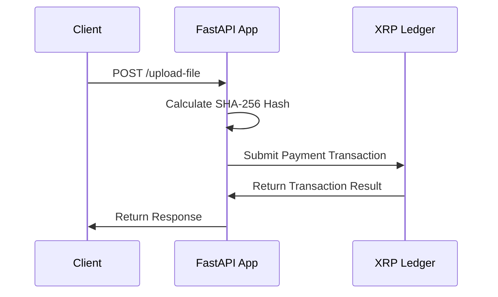
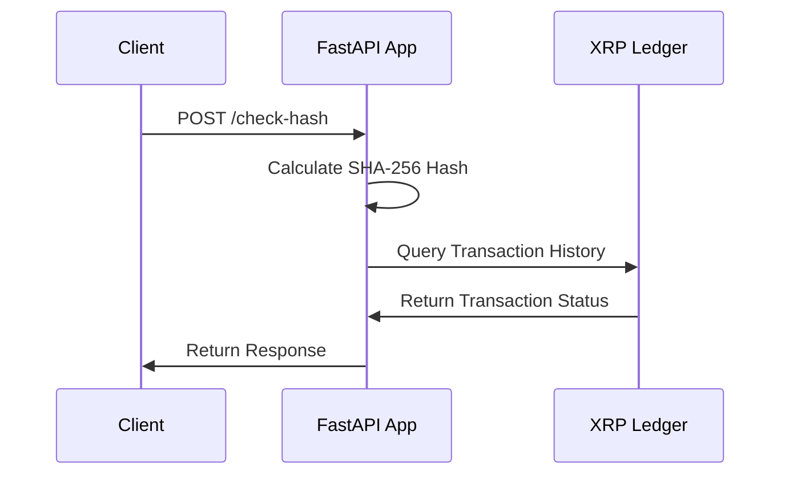
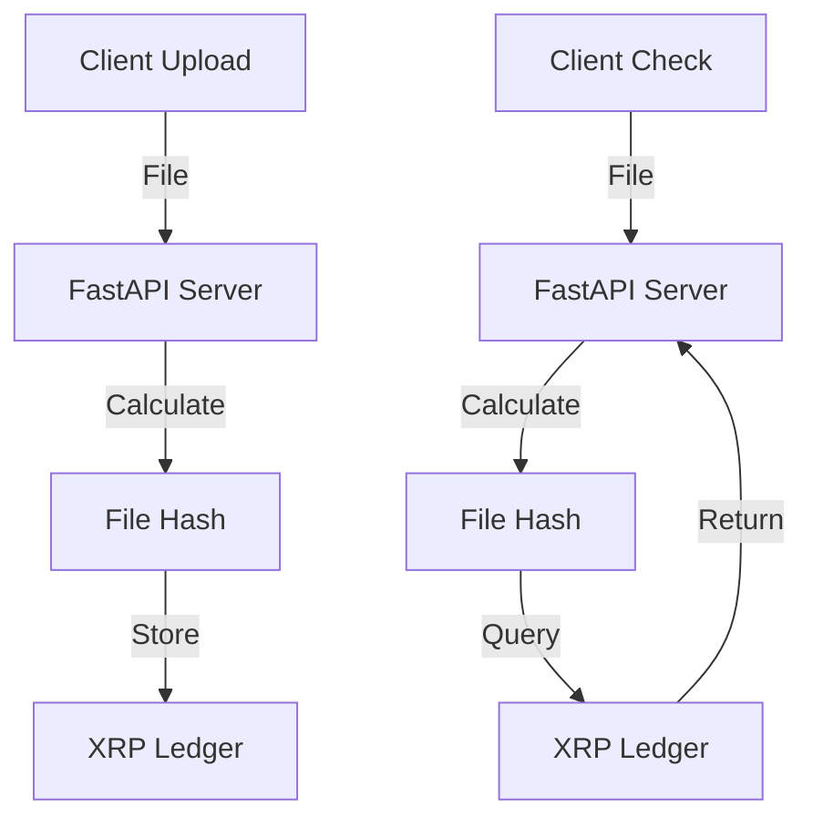

## Technical Design Information

### Overview

This project is a FastAPI application that interacts with the XRP Ledger to submit payment transactions and check the
state of transactions based on file hashes. The application provides two main endpoints: `/upload-file`
and `/check-hash`.

## System Design Diagrams

### System Architecture

The following diagrams illustrate the system's components and their interactions.

#### Component Diagram



### Sequence Diagram - File Upload Flow



### Sequence Diagram - Hash Check Flow



### Data Flow Diagram



1. **Client Layer**

    - Sends HTTP requests to upload files or check file hashes
    - Handles multipart/form-data file uploads
    - Receives JSON responses with transaction results

2. **Application Layer (FastAPI)**

    - Processes incoming file uploads
    - Calculates SHA-256 file hashes
    - Manages XRP Ledger interactions
    - Handles error scenarios and responses

3. **Blockchain Layer (XRP Ledger)**

    - Stores file hashes in transaction memos
    - Provides transaction verification
    - Ensures immutable record keeping

4. **Security & Configuration**
    - Environment-based configuration
    - Secure wallet management
    - Error handling and validation

### Key Components

#### `main.py`

- **Endpoints**:

    - `POST /upload-file`: Uploads a file, calculates its SHA-256 hash, submits a payment transaction with the hash in
      the memo, and returns the transaction result.
    - `POST /check-hash`: Uploads a file, calculates its SHA-256 hash, checks if the hash exists in the account's state,
      and returns the result.
    - `POST /get-hash`: Returns the SHA-256 hash of the given file content.
    - `POST /write-hash`: Writes the given hash to the account's state.

- **Functions**:
    - `upload_file(file: UploadFile)`: Handles file upload, hash calculation, and transaction submission.
    - `check_hash(file: UploadFile)`: Handles file upload, hash calculation, and state checking.

#### `xrpl_utils.py`

- **Functions**:

    - `calculate_hash(file_content: bytes) -> str`: Calculates the SHA-256 hash for the given file content.
    - `submit_payment_transaction(hash_hex: str)`: Submits a payment transaction with the given hash in the memo.
    - `check_hash_in_state(hash_hex: str)`: Checks if the given hash exists in the account's state.

- **Environment Variables**:
    - `SOURCE_SECRET`: The secret key for the source wallet.
    - `JSON_RPC_ENDPOINT`: The JSON-RPC endpoint for interacting with the XRP Ledger.

### Environment Configuration

The application uses environment variables defined in the `.env` file:

```
SOURCE_SECRET=<your_source_secret>
JSON_RPC_ENDPOINT=<your_json_rpc_endpoint>
```

### How to Run

1. Install dependencies:

   ```sh
   pip install -r requirements.txt
   ```

2. Run the FastAPI application:

   ```sh
   uvicorn main:app
   ```

3. Test the endpoints using the provided `test_main.http` file or any API testing tool.

### Example Usage

- **Upload File**:

  ```http
  POST http://127.0.0.1:8000/upload-file
  Content-Type: multipart/form-data
  file: <your_file>
  ```

- **Check Hash**:
  ```http
  POST http://127.0.0.1:8000/check-hash
  Content-Type: multipart/form-data
  file: <your_file>
  ```

### Error Handling

The application raises HTTP 500 errors with appropriate messages if any exceptions occur during file processing,
transaction submission, or state checking.

### Dependencies

- `fastapi`
- `uvicorn`
- `xrpl-py`
- `python-dotenv`

### Project Files

- `main.py`: FastAPI application with endpoints for file upload and hash checking.
- `xrpl_utils.py`: Utility functions for interacting with the XRP Ledger.
- `.env`: Environment configuration file.
